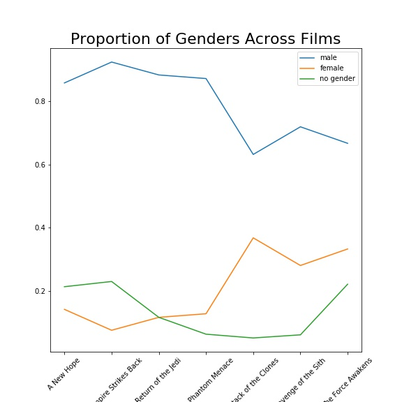

# Star Wars API

### Minimum Viable Product

[Click here](https://github.com/timothy-salazar/swapi/tree/master/fancy_graphing) for the fancy graphs.

1. It seems like there is quite a variety of heights in the Star Wars Universe. Show us the distribution of
heights across gender, homeworld, and species.
2. The Original Trilogy and the Prequel Trilogy both featured men in leading roles and women in
supporting roles, but the Sequel Trilogy features a leading woman. What is the distribution of
genders across the films?
3. Back to our difficult-to-explain interest in heights: can you find and visualize a linear regression that
clearly explains the height of an individual?

Using a programming language and/or framework of your choice, write a program that gives us insight into
these questions. We like visualizations (e.g. charts and graphs), not tables or lists of numbers. If you have any
other ideas, questions or insights from the data, we’d love to see those as well!

## Question 1:

There are far fewer females to work with, but we can get a general idea of the distribution of height vs. gender from this histogram.

This isn't nearly as clear-cut as the first example, since most of the planets in the database have only one named inhabitant. 
The most populous worlds are pictured here. Tatooine and Naboo have 10 and 11 named inhabitants respectively, the rest that
I created histograms for only had 3, but I thought I'd include them anyway - we're doing this is all for illustrative 
purposes, we're not looking for statistical rigor.

This could also be better - again, because of small sample sizes. These histograms show 35 humans, 5 droids, and 3 gungans. 
The human histogram looks more or less alrigh, but the other two populations are just too small to show something close
to the nice bell curve we'd expect.

## Question 2:

Just some bar graphs. This tells us a little bit, but we might be able to see the actual trends better if we put it all on one graph.

This is a bit better. 

# Question 3 
Back to our difficult-to-explain interest in heights: can you find and visualize a linear regression that clearly explains the height of an individual? 

# Linear Regression
A lot of people sneer at linear regression because it isn't as shiny as the newer, more complicated models that are available. But linear regression has a lot of advantages, and it's often the best model for a problem.
- It's interpretable - an advantage that many more complicated models, such as neural networks, lack
- It's simple, which means it's easy to get up and running quickly

Linear regression has relatively high bias and low variance, which means that it's a little bit harder to overfit than some more complicated models. There is a limit though - and each variable that we add to our model will make it easier to overfit. It's probably a good idea to use just a few of these columns to fit our model. 

Additionally, we need to put our data into a form that our linear regression can "understand". If we want to use columns that have non-numerical values, first we'll need to transform them into numbers.

# Feature Engineering
"birth_year" and "mass" are the only variables that are are numerical. We'll need to transform the rest of our data to make it fit. The biggest problem with these two values is the relatively large number of missing values (especially with birth_year.
- eye_color - the most common colors are brown and blue. There is a wide variety of more exotic colors, so I think an "is brown or blue" column would make sense.
- gender - the "Gender Across Films" graph above is a bit deceptive, since the same droids tend to appear across a lot of films. They only really represent 5 datapoints. I'll do an "is female" column.
- hair_color - I'll make this into an "is bald" column
- mass - this is fine 
- skin_color - I'll say that everything that isn't "fair","light","dark" is an unusual skin color
- homeworld - skiping this one
- species - human and other
## Results
By dropping "birth_year" and keeping the rest of my engineered features, I was able to get an R^2 score of 0.79. The R^2 statistic is basically tells us how much of the variability in the data our model can account for. A score of .79 means that our model can account for about 80% of the variability. There are only 87 data points, and our data doesn't necessarily map onto any actual ground truth since these aren't people drawn at random from a population, they're actors cast into roles. This is demonstrated best by the distribution of genders, which is 50/50 in the real world (and presumably in the Star Wars universe), but which is heavily skewed towards males in the data we are given. 

I'll add a little bit more visualization here in a bit.
