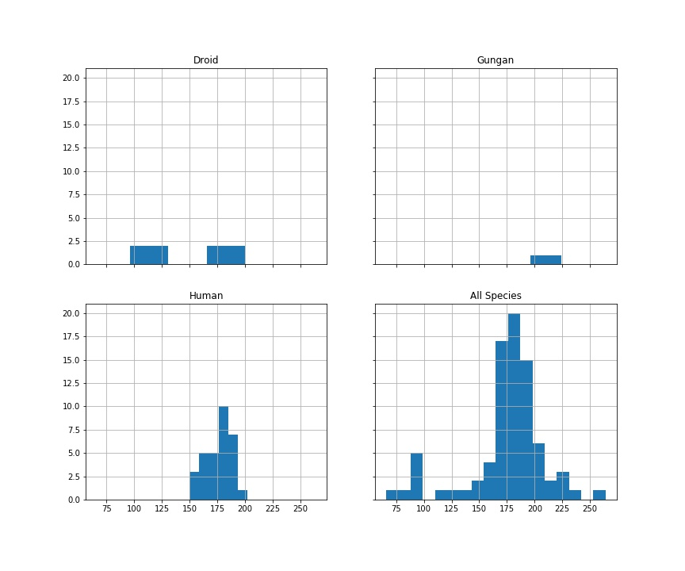

# Star Wars API

### Minimum Viable Product

1. It seems like there is quite a variety of heights in the Star Wars Universe. Show us the distribution of
heights across gender, homeworld, and species.
2. The Original Trilogy and the Prequel Trilogy both featured men in leading roles and women in
supporting roles, but the Sequel Trilogy features a leading woman. What is the distribution of
genders across the films?
3. Back to our difficult-to-explain interest in heights: can you find and visualize a linear regression that
clearly explains the height of an individual?

Using a programming language and/or framework of your choice, write a program that gives us insight into
these questions. We like visualizations (e.g. charts and graphs), not tables or lists of numbers. If you have any
other ideas, questions or insights from the data, we’d love to see those as well!

## Question 1:

There are far fewer females to work with, but we can get a general idea of the distribution of height vs. gender from this histogram.

This isn't nearly as clear-cut as the first example, since most of the planets in the database have only one named inhabitant. 
The most populous worlds are pictured here. Tatooine and Naboo have 10 and 11 named inhabitants respectively, the rest that
I created histograms for only had 3, but I thought I'd include them anyway - we're doing this is all for illustrative 
purposes, we're not looking for statistical rigor.

